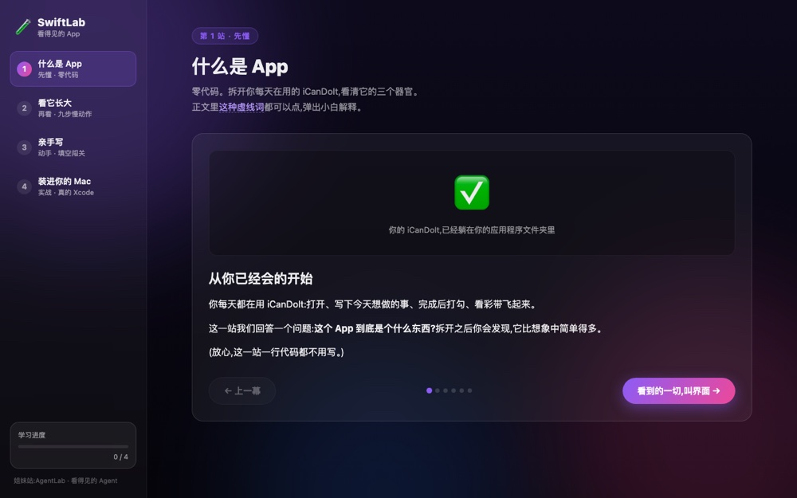

# SwiftLab — See an App Take Shape

**▶ [Open the course](https://renrenmimi.github.io/SwiftLab/)** — runs in your browser, nothing to install.

An interactive Swift and SwiftUI course for people starting from zero. It takes
[iCanDoIt](https://github.com/renrenmimi/iCanDoIt) apart and rebuilds it in front of you,
from a single `Hello, world!` line to a real macOS app.

Sister site: [AgentLab](https://agent-lab-blond.vercel.app) — see inside an AI agent.

**The point: the interface is a function of your data.**

*The course — four stops from Hello, world to a real macOS app*

## How to open it

Double-click `index.html`. It is a plain static page — nothing to install.

## Four stops

1. **What an app is** — six scenes, no code: interface, data, events, then the formula.
2. **Watch it grow** — nine steps in slow motion. Code on the left (green marks what this
   step added), the app growing on the right; several of the mock windows are interactive.
3. **Write it yourself** — a miniature iCanDoIt with eight blanks. Each blank teaches before
   it asks; wrong answers get a specific correction, and three misses unlock the answer.
   Get them all and you can "run" it.
4. **Put it on your Mac** — a seven-step checklist for doing it in real Xcode. The full
   source is included.

## Notes on design

- **A glossary built into the prose** — writing `[[key:label]]` in the body renders a
  clickable term that pops up a beginner-level explanation (see `GLOSSARY` in `data.js`).
- **Button labels say what comes next** — stop 2's primary button reads "Next beat: give it a
  memory →".
- **Per-option corrections** — every wrong option has its own explanation of why it is
  wrong and what the compiler would say.
- **Progress persists** to `localStorage`.

## Files

| File | Role |
|---|---|
| `index.html` | The page shell |
| `styles.css` | Dark glass and aurora visuals, matching the real iCanDoIt |
| `data.js` | All course content — glossary, the four stops, the full source |
| `app.js` | Interaction — stop switching, syntax highlighting, the fill-in-the-blank flow |

---

© 2026 Weiren Feng. All rights reserved. Published for reading and portfolio purposes; not
licensed for reuse, modification, or redistribution.
